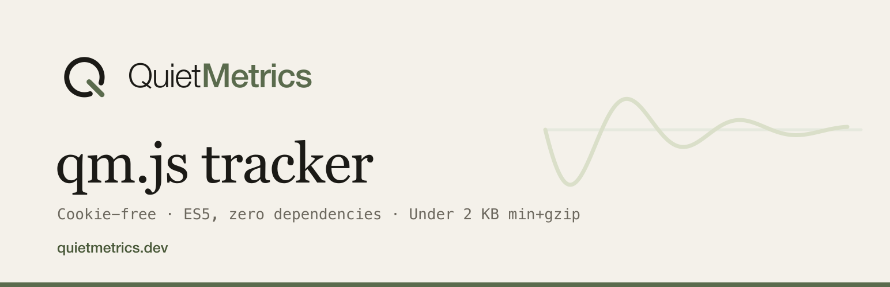

# Quiet Metrics qm.js : tracker JavaScript



> 🇬🇧 [English version](README.md)

Script de mesure d'audience sans cookie d'identification ni de traçabilité pour [Quiet Metrics](https://quietmetrics.dev), édité par La Boîte à Code. ES5, zéro dépendance, aucun build : un seul fichier, cible 4 Ko servis, sans minification.

## Installation

### Balise script (cas général)

```html
<script>window.qm=window.qm||function(){(window.qm.q=window.qm.q||[]).push(arguments)}</script>
<script defer src="https://quietmetrics.dev/qm.js" data-site="qm_pub_XXXX"></script>
```

La première ligne installe une file d'attente : tout appel `qm(...)` fait avant le chargement du script est rejoué automatiquement.

> **Pourquoi pas d'attribut `integrity` (SRI) sur cette balise ?** Le script
> servi par la plateforme est mis à jour côté serveur ; une empreinte SRI
> épinglerait une version et casserait la mesure en silence à la première mise
> à jour. Si vous voulez l'immutabilité, prenez la copie first-party
> ci-dessous : servie par votre domaine, sous votre contrôle (et libre à vous
> d'y ajouter un SRI puisque vous décidez des mises à jour). Dans tous les
> cas, une CSP `script-src` restrictive est documentée dans le guide
> d'installation.

### Copie first-party (anti-adblock)

Copiez `tracker.js` sur votre propre domaine (ou servez-le via le proxy `qm-proxy.php` du package PHP) :

```html
<script defer src="https://monsite.fr/qm.js" data-site="qm_pub_XXXX"></script>
```

L'endpoint de collecte est déduit de l'origine du `src` (`…/collect`) : servir le script depuis votre domaine suffit à ce que la collecte passe aussi par votre domaine. Les listes de blocage par nom de domaine deviennent inopérantes.

## Configuration (attributs `data-*` de la balise)

| Attribut | Défaut | Effet |
|---|---|---|
| `data-site` | (requis) | Clé publique du site (`qm_pub_…`) |
| `data-endpoint` | déduit du `src` (`…/collect`) | URL de collecte explicite (proxy first-party, sous-domaine dédié) |
| `data-spa` | `true` | Pages vues automatiques sur `pushState`/`replaceState`/`popstate` |
| `data-hash` | `false` | `true` : routage par `#fragment` (le hash entre dans l'URL mesurée, `hashchange` écouté) |
| `data-outbound` | `true` | Événement automatique « Lien sortant » au clic sur un lien externe |
| `data-downloads` | `false` | `true` : événement « Téléchargement » au clic sur un lien de fichier (pdf, zip, docx…). Opt-in volontaire : ces événements comptent dans le quota, une mise à jour ne doit pas gonfler une facture. |
| `data-404` | `false` | `true` : événement « 404 » avec le chemin demandé. À poser sur le seul gabarit d'erreur ; la page vue reste comptée normalement. |
| `data-exclude` | (vide) | Préfixes de chemins ignorés, séparés par des virgules : `/admin,/preview` |
| `data-dnt` | (off) | `respect` : n'émet rien si Do Not Track ou Global Privacy Control est actif |
| `data-dev` | `false` | `true` : autorise localhost et les IP privées (développement) |

## Usage

```js
// Événement personnalisé (nom <= 120 caractères, propriétés scalaires)
qm('inscription', { plan: 'pro' });

// Page vue manuelle (utile avec data-spa="false")
qm.pageview();

// Kill switch, par exemple pour exclure les utilisateurs connectés
window.__qmDisable = true;
```

Ces appels fonctionnent aussi avant le chargement du script grâce au snippet de file d'attente. Un appel `qm()` sans nom est ignoré.

## Comment ça marche

- Chaque hit est un `POST` JSON avec des clés courtes (`k` clé du site, `t` type, `u` URL, `r` referrer, `w` largeur d'écran, `l` langue, `n` nom d'événement, `p` propriétés). Spec complète : `docs/05-api-et-sdk.md` à la racine du monorepo.
- Envoi par `navigator.sendBeacon` (fiable au déchargement de page), repli `fetch keepalive`, puis `XMLHttpRequest`.
- Corps en `text/plain` : pas de préflight CORS, une seule requête par hit.
- Déduplication locale : un même chemin n'émet pas deux pageviews consécutives (double `pushState`).
- N'émet jamais : marqueur d'exclusion posé par le visiteur (voir ci-dessous), navigateurs pilotés (`navigator.webdriver`), localhost et IP privées (sauf `data-dev`), chemins exclus, DNT/GPC si `data-dnt="respect"`.
- Tous les échecs réseau sont silencieux : l'analytics ne casse jamais le site mesuré.

## S'exclure de la mesure

N'importe qui peut demander à ne plus être compté sur un site suivi, sans compte et sans écrire à personne : il lui suffit de visiter une page de ce site avec `?qm_ignore=1`.

```
https://monsite.fr/?qm_ignore=1     ne plus être compté
https://monsite.fr/?qm_ignore=0     être compté à nouveau
```

Le marqueur posé par cette visite s'appelle `qm_ignore` et vaut `1`. Il est écrit des **deux côtés** : cookie propriétaire du site suivi (`path=/`, `samesite=lax`, `secure` en https, cinq ans) **et** `localStorage`. Ce n'est pas une ceinture doublée de bretelles : `localStorage` prend le relais là où le cookie est refusé ou effacé, et le cookie est le seul des deux qu'un SDK serveur sache lire. Une seule visite couvre ainsi le suivi par script comme le suivi serveur.

Le marqueur ne contient aucun identifiant (sa valeur est la même chez tout le monde), il n'est jamais transmis à Quiet Metrics, et il n'existe que pour arrêter la mesure. La visite qui le pose n'est pas comptée ; celle qui le retire l'est immédiatement.

## Vie privée

Rien n'est stocké chez le visiteur pour le mesurer : ni cookie d'identification, ni identifiant en localStorage, ni fingerprinting côté client. La seule écriture est le marqueur d'exclusion ci-dessus, posé à la demande de la personne pour qu'on cesse de la compter. L'identification de visite est faite côté serveur par hash journalier non réversible (voir `docs/02-faisabilite-rgpd.md`).

## Taille

Fichier source : de l'ordre de 8,8 Ko, dont près de la moitié de commentaires. Il est servi **tel quel** : aucune étape de minification n'existe dans la chaîne, contrairement à ce que ce README a longtemps affirmé. Cela fait environ 3,7 Ko compressés, pour un plafond annoncé de 4 Ko.

Conséquence à garder en tête avant d'écrire ici : les commentaires de ce fichier partent chez chaque visiteur de chaque site client. Ils ne sont pas gratuits, contrairement à ceux du reste du dépôt.

Il reste environ 275 octets de marge. Se mesure avant d'ajouter, pas après :

```bash
gzip -9 -c apps/platform/public/qm.js | wc -c
```

Minifier au déploiement ramènerait le fichier servi autour de 2 Ko et rendrait les commentaires gratuits. La piste a été examinée le 28 août 2026 puis écartée : elle ajouterait une étape de construction et une dépendance `terser` à un paquet qui n'en a aucune, et `TrackerSyncTest` garde aujourd'hui les copies servies comme byte-identiques à la source.

## Tests

Harnais Node sans dépendance (simulation minimale de `window`/`document`) :

```bash
node --check tracker.js
node tests/run.js
```

## Licence

MIT. Un produit [La Boîte à Code](https://laboiteacode.fr) pour [Quiet Metrics](https://quietmetrics.dev).
